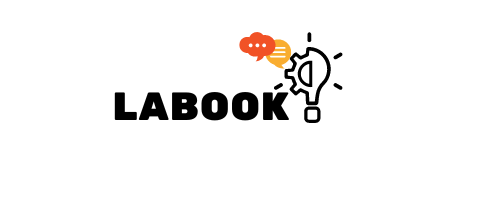

# Projeto LabeCommerce

## Índice
> <a href="#tecnologias">Tecnologias utilizadas</a>

> <a href="#funcionalidades"> Funcionalidades do projeto</a>

> <a href="#endpoints"> Endpoints</a>

> <a href="#bd"> Banco de Dados</a>

> <a href="#documentacao"> Documentação da API</a>

<h2 id="tecnologias"> Tecnologias utilizadas</h2>

 - NodeJS
 - Typescript
 - Express
 - SQL e SQLite
 - Knex
 - Postman
 - Moment
 - POO
 - Arquitetura em camadas
 - Geração de UUID
 - Geração de hashes
 - Autenticação e autorização
 - Roteamento

<h2 id="funcionalidades"> Funcionalidades do projeto</h2>

USUARIOS
- <b>Get Users (Lista usuários):</b> 
  - Endpoint protegido, requer um token jwt para acessá-lo;
  - Lista todos os usuários cadastrados,
  - Possibilidade de pesquisar nome de usuário através de query;
- <b>Signup (Criar usuário):</b> 
  - Endpoint público utilizado para cadastro. Devolve um token jwt;
  - Possibilita criar novos usuários;
  - Não é possível criar mais de uma conta com o mesmo e-mail;
  - Identificação do usuário por UUID
  - Senhas hasheadas com Bcrypt
 

POSTS
- <b>Get posts (Lista Todos Posts):</b> 
  - Endpoint protegido, requer um token jwt para acessá-lo;
  - Lista todos os posts publicados;
  - Possibilidade de pesquisar post pelo nome através de query;
- <b>Create post (Criar Post):</b> 
  - Endpoint protegido, requer um token jwt para acessá-lo;
  - Possibilita criar novos posts;
 - <b>Edit post (Edição de Post):</b> 
   - Endpoint protegido, requer um token jwt para acessá-lo;
   - Só quem criou o post pode editá-lo e somente o conteúdo pode ser editado.
  - <b>Delete post (Deletar Post):</b> 
    - Endpoint protegido, requer um token jwt para acessá-lo; 
    - Só quem criou o post pode deletá-lo. Admins podem deletar o post de qualquer user.
   - <b>Like or dislike:</b>
     - Endpoint protegido, requer um token jwt para acessá-lo.
     - Quem criou o post não pode dar like ou dislike no mesmo.
     - Caso dê um like em um post que já tenha dado like, o like é desfeito.
     - Caso dê um dislike em um post que já tenha dado dislike, o dislike é desfeito.
     - Caso dê um like em um post que tenha dado dislike, o like sobrescreve o dislike.
     - Caso dê um dislike em um post que tenha dado like, o dislike sobrescreve o like.

<h2 id="endpoints"> Endpoints</h2>

* USERS
  - Get All Users
  - Signup
  - Login

* PRODUCTS
  - Get posts
  - Create post
  - Edit post
  - Delete post 
  - Like or dislike
  
 
  <h2 id="bd"> Banco de Dados</h2>

<h2 id="documentacao"> Documentação da API</h2>

[Link da Documentação] Em Desenvolvimento ...

